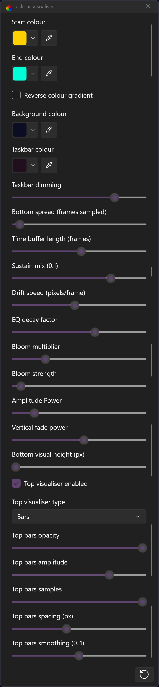

# audio-taskbar-visualiser

Lively Wallpaper Music wallpaper - to be used with TranslucentTB

## Requirements:

- [Lively Wallpapers](https://github.com/rocksdanister/lively)
- [TranslucentTB](https://github.com/TranslucentTB/TranslucentTB)

## Installation:

Just download [visualiser.zip](visualiser.zip) and drag it into the Lively Wallpapers window to install, customisation is available in the app.

## Configuration:

### Colours
* **Start/End colour** — sets start and end gradient colours. 
* **Reverse colour gradient** — flips the colour gradient direction - uses HSV colour blending. 
* **Background colour** — main wallpaper background colour behind the graphic equaliser. 
* **Taskbar colour** — taskbar colour displayed behind the visualiser. 
* **Taskbar dimming** — dims the visualiser in order to keep UI icons on the taskbar legible. 

### Bottom Taskbar Visualiser
* **Bottom spread (frames sampled)** — how much neighbouring pixels affects its neighbours - creates a smoother blend. 
* **Time buffer length (frames)** — Lower values = less memory usage, Higher values = pulses last longer before being cut off. 
* **Sustain mix** — how much of the previous amplitude is kept when calculating delta frames - lower values = extended beats have more energy. 
* **Drift speed (pixels/frame)** — how fast the colours drift sideways across the taskbar. 
* **EQ decay factor** — how quickly the pulses fade out. 
* **Bloom multiplier** — boosts the raw visualiser intensity. 
* **Bloom strength** — how strongly bright areas bleed into white. 
* **Amplitude power** — non-linear scaling for pulse intensity (higher = more contrast). 
* **Vertical fade power** — how quickly the bottom fade transitions into the taskbar. 
* **Bottom visual height (px)** — height of the bottom visualiser - set to the same height or slightly smaller than your taskbar. 

### Top Visualiser
* **Top visualiser enabled** — toggles the top section on/off. 
* **Top visualiser type** — choose between Bars mode or Wave mode. 
* **Top bars opacity** — transparency of the top visualiser. 
* **Top bars amplitude** — height scale of the top bars/wave. 
* **Top bars samples** — number of bars/points drawn (resolution). 
* **Top bars spacing (px)** — gap between top bars (only in Bars mode). 
* **Top bars smoothing (0..1)** — how much the top visualiser is smoothed to prevent jittery movements. 

